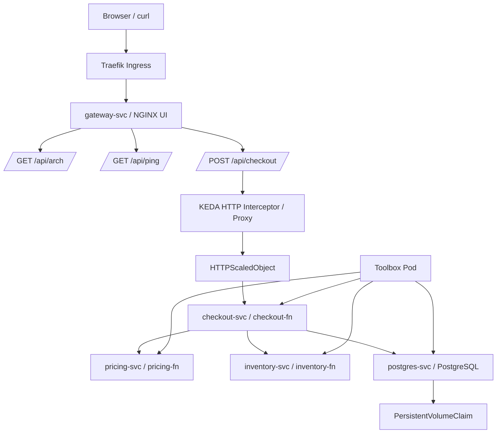

# Enterprise Architecture Design Assignment 1

## 1. Introduction

This project implements a serverless-style nanoservices architecture using both Docker Compose and Kubernetes (K3s), with a focus on scalability, observability, and fault tolerance. The system models a simplified checkout workflow composed of multiple independent services, including pricing, inventory, checkout, and a gateway, with PostgreSQL used for persistence.

The primary objective of the assignment is to evaluate how nanoservices behave when deployed using traditional container orchestration (Docker Compose) versus Kubernetes, and to extend the Kubernetes deployment with platform-level capabilities such as autoscaling, tracing, and persistence. In particular, the project explores serverless-style execution using KEDA, enabling scale-to-zero behaviour for HTTP workloads.

The architecture demonstrates key distributed system characteristics, including synchronous service composition, partial failure scenarios, and increased latency due to multiple network hops. It also highlights operational concerns such as deployment management, readiness and liveness, service discovery, and troubleshooting using Kubernetes-native tools.

Throughout the implementation, evidence is collected to compare Compose and Kubernetes in terms of setup complexity, operational control, resilience, and networking. Additional experiments include cold-start measurement, request correlation using X-Request-Id, and persistence validation using PostgreSQL with a Persistent Volume Claim (PVC).

---

## 2. Solution Design

The system is designed as a nanoservices-based architecture, where each service is responsible for a single, well-defined function.

Core services:

- **pricing-fn**: calculates tax and total price  
- **inventory-fn**: checks stock availability  
- **checkout-fn**: composes pricing and inventory results  
- **gateway**: routes requests and serves UI  
- **postgres**: stores checkout data  

---

### 2.1 System Architecture

The architecture follows a layered request flow, with ingress routing external traffic to the gateway, which then orchestrates service communication. The checkout path is enhanced using KEDA, enabling scale-from-zero behaviour.

2.2 Nanoservices Architecture

Nanoservices promote strong separation of concerns, allowing each service to remain simple and focused. This improves maintainability and scalability but introduces trade-offs such as increased network communication and potential partial failures.

2.3 Serverless-Style Execution with KEDA

KEDA enables scale-to-zero functionality for HTTP workloads. The HTTP interceptor captures incoming requests, triggers scaling, and forwards traffic once pods are ready.

This introduces cold-start latency but significantly improves resource efficiency.

2.4 Persistence Layer

PostgreSQL is deployed with a Persistent Volume Claim (PVC) to ensure data durability. This guarantees that data persists even if pods are restarted or replaced.

2.5 Request Flow
What is this?

A typical request begins at the client and flows through ingress, gateway, and the KEDA interceptor before reaching the checkout service. The checkout service orchestrates calls to pricing and inventory, aggregates results, stores the outcome in PostgreSQL, and returns a response.

3. Implementation

The system was initially implemented using Docker Compose, where all services were defined in a single configuration file and executed within a shared network.

In Kubernetes, each service was deployed using:

Deployments for pod management
Services for internal communication
Ingress (Traefik) for external routing
Secrets for database credentials
PersistentVolumeClaims (PVC) for storage

KEDA was installed using manifest-based deployment and extended with the HTTP add-on to enable HTTP-triggered scaling.

The checkout service was configured with an HTTPScaledObject, allowing it to scale dynamically based on incoming traffic.

## 4. Testing and Troubleshooting
### 4.1 Functional Testing

The system was validated using:

- `/api/arch`
- `/api/ping`
- checkout requests

Successful responses confirmed correct service integration.

### 4.2 Partial Failure Scenario

The inventory service was scaled to zero:

`kubectl scale deployment inventory-fn --replicas=0`

Results:

gateway endpoints remained available
checkout failed due to missing dependency
inventory service had no endpoints

This demonstrated partial system failure.

### .3 Bad Rollout Scenario

A faulty image was deployed:

`ead/pricing-fn:broken-tag`

Results:

ImagePullBackOff error
rollout did not complete

Recovery was achieved by restoring a valid image version.

4.4 Readiness Failure

A misconfigured readiness probe caused pods to remain in Running but not Ready.

Results:

service had no endpoints
traffic was not routed

Fixing the probe restored normal behaviour.

4.5 Troubleshooting Workflow

The following commands were used:

kubectl get deploy,pods,svc,ingress
kubectl describe pod <pod>
kubectl logs <pod>
kubectl get events
kubectl get endpoints

These commands helped diagnose issues related to image failures, readiness problems, and service routing.

## 5. Performance and Scaling

The system successfully demonstrated scale-to-zero behaviour using KEDA.

Measured results:

- Cold checkout: ~7.9 seconds
- Warm checkout: ~0.04 seconds

The cold request includes scaling delay, container startup, and readiness checks. The warm request benefits from already running pods.

This highlights the trade-off between cost efficiency and latency in serverless-style systems.

## 6. Conclusion

This project successfully demonstrated the design, deployment, and operation of a nanoservices architecture using Kubernetes.

Key findings:

Kubernetes provides stronger orchestration and resilience compared to Docker Compose
KEDA enables serverless-style scaling but introduces cold-start latency
persistent storage using PVC ensures data durability
distributed systems increase complexity but improve scalability

Overall, the system highlights both the advantages and trade-offs of nanoservices, particularly in relation to performance, fault tolerance, and operational complexity.